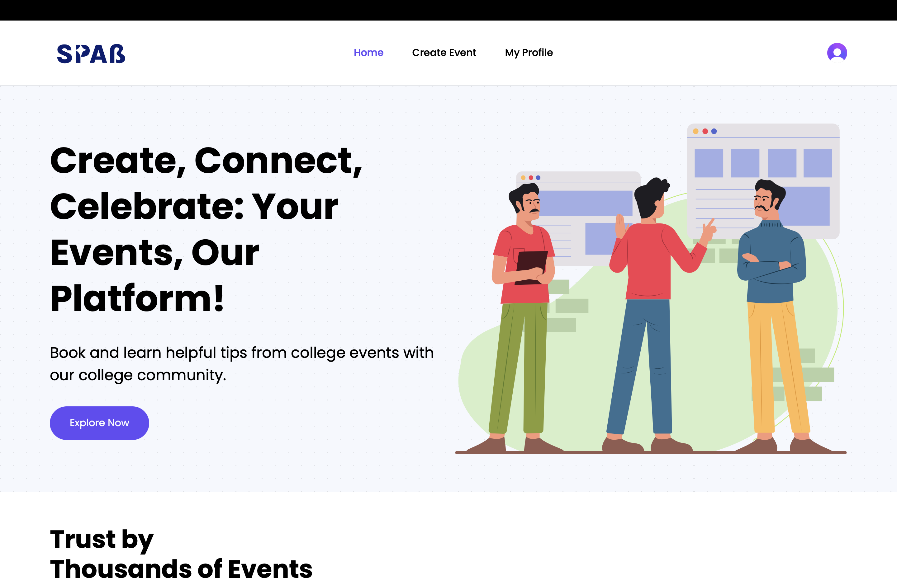
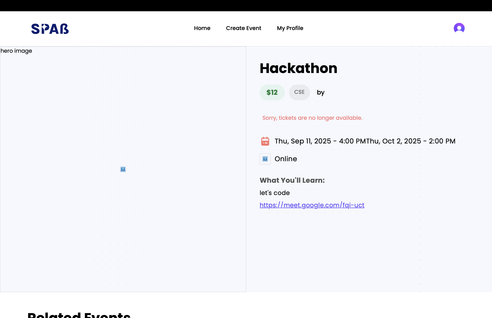
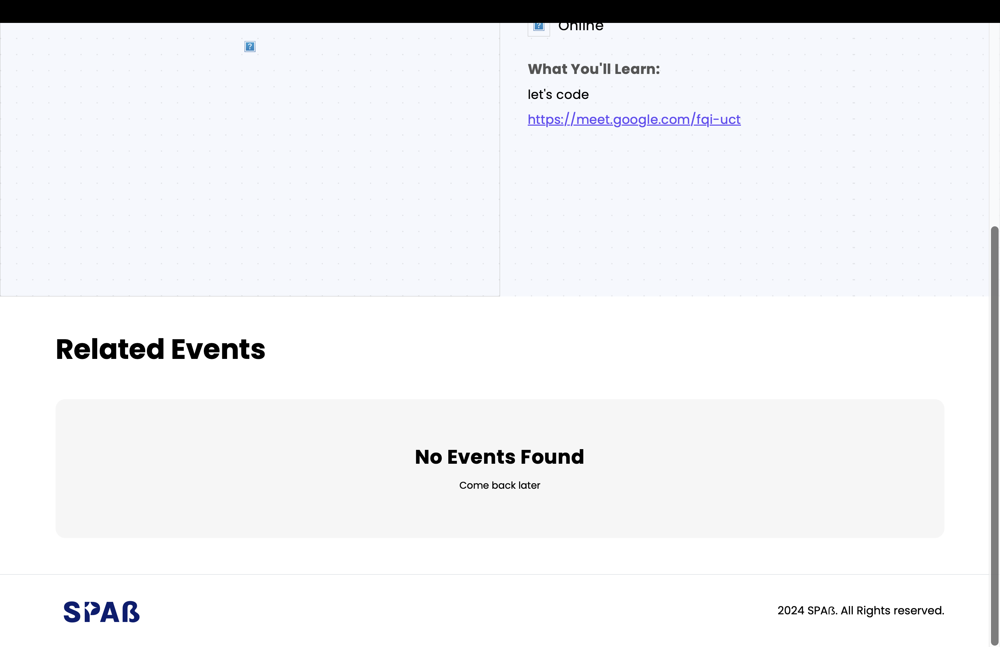
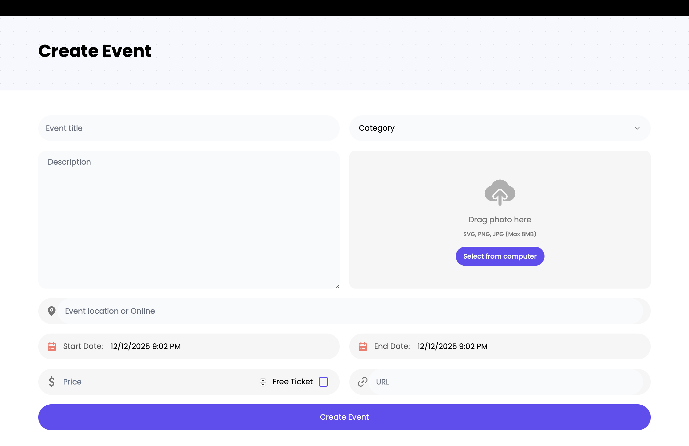
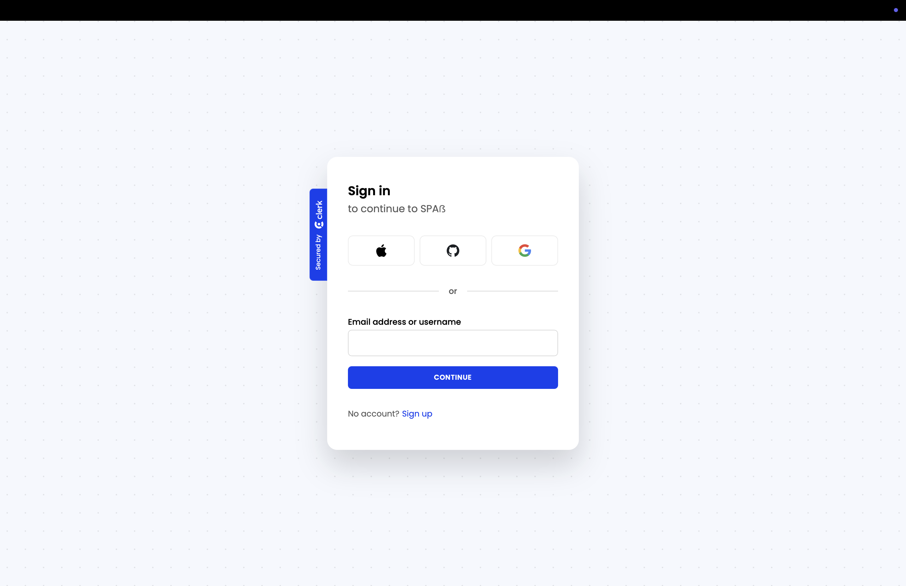
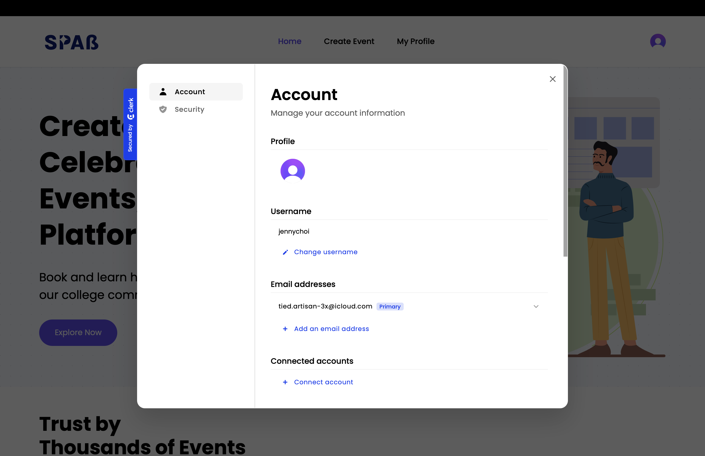

SPAS – Event & Category Management Platform

SPAS is a full-stack MERN + Next.js application designed to manage events, categories, bookings, payments, and media uploads with a modern, scalable architecture.

⸻

🚀 Tech Stack

Frontend
	•	Next.js 14 (App Router) – File-based routing, server components, optimized rendering
	•	React – Component-based UI
	•	Tailwind CSS – Utility-first modern styling
	•	ShadCN/UI – Reusable UI components (Button, Dialog, Sheet, Select, etc.)

Backend
	•	Node.js & Next.js Server Actions
	•	MongoDB with Mongoose – Database + models
	•	Stripe Webhooks – Payments & invoice updates
	•	Clerk Authentication – Secure login/signup
	•	UploadThing – File uploads (images/documents)

Other Tools
	•	TypeScript – Type safety
	•	Vercel – Hosting and deployment
	•	Figma (UI planning)

⸻

📌 Core Features

🟦 User & Auth
	•	Secure login & signup via Clerk
	•	Middleware-based auth protection (middleware.ts)

🟧 Events Management
	•	Create event
	•	Update event
	•	Delete event
	•	View event details

Location:

/app/(root)/events/

🟩 Categories
	•	Create, list, and update categories
	•	Used to classify events

🟪 Orders & Payments
	•	Stripe integration (sandbox mode)
	•	Payment success/failure handling
	•	Webhook verification

🟫 Image Uploads
	•	UploadThing integration
	•	Drag-and-drop upload UI
	•	Server route handling

Routes:

/app/api/uploadthing/*

⸻

📁 Folder Structure (Overview)

app/
  (root)/
    events/
    orders/
    page.tsx
  (auth)/
    sign-in/
    sign-up/
  api/
    webhook/
      stripe/
      clerk/
    uploadthing/
components/ui/
constants/

(Full file list provided in project_structure.txt)

⸻

🖼️ Screenshots 

All screenshots related to the application UI are stored here:

/screenshots Folder

⸻

⚙️ Environment Variables

Create a .env.local file:

MONGODB_URI=
NEXT_PUBLIC_CLERK_PUBLISHABLE_KEY=
CLERK_SECRET_KEY=
STRIPE_SECRET_KEY=
STRIPE_WEBHOOK_SECRET=
UPLOADTHING_SECRET=
UPLOADTHING_APP_ID=

⸻

🧪 Testing APIs

Use Postman / Thunder Client for testing:
	•	/api/uploadthing – For media uploads
	•	/api/webhook/stripe – For payment confirmation
	•	/api/test-db – For database connection check

⸻

🚀 Deployment Notes
	•	Hosted on Vercel
	•	Make sure to add all environment variables
	•	Stripe Webhooks must be updated using Vercel deployment URL

⸻

🙌 Author

Jenny – Aspiring Full-stack Developer
